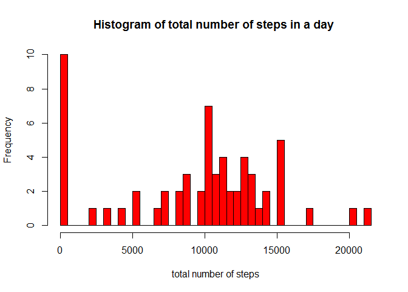
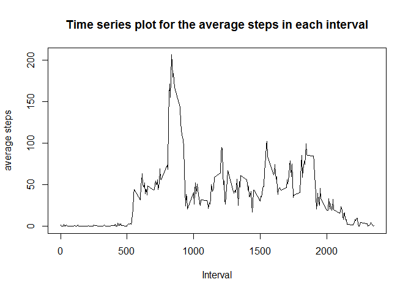
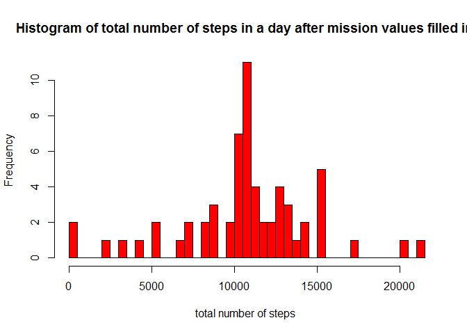
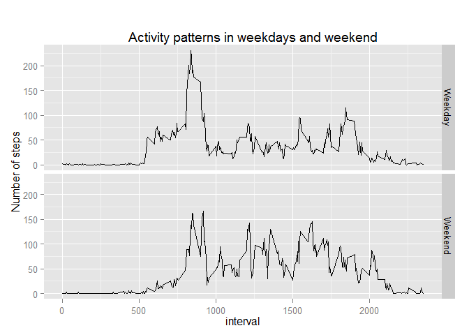

# Reproducible Research: Peer Assessment 1

## Loading and preprocessing the data, load library


```r
library(dplyr)
```

```
## 
## Attaching package: 'dplyr'
## 
## The following object is masked from 'package:stats':
## 
##     filter
## 
## The following objects are masked from 'package:base':
## 
##     intersect, setdiff, setequal, union
```

```r
library(plyr)
```

```
## -------------------------------------------------------------------------
## You have loaded plyr after dplyr - this is likely to cause problems.
## If you need functions from both plyr and dplyr, please load plyr first, then dplyr:
## library(plyr); library(dplyr)
## -------------------------------------------------------------------------
## 
## Attaching package: 'plyr'
## 
## The following objects are masked from 'package:dplyr':
## 
##     arrange, count, desc, failwith, id, mutate, rename, summarise,
##     summarize
```

```r
#read data
mydata<-read.csv("activity.csv") 

#change date to data type Date
mydata$date<-as.Date(mydata$date,"%Y-%m-%d")
```

## What is mean total number of steps taken per day?


```r
# aggregate the activity data by day
newdata1<-ddply(mydata,~date,summarise,total_steps=sum(steps,na.rm=TRUE))

# Plot a histogram
hist(newdata1$total_steps,freq=NULL,breaks=50, main="Histogram of total number of steps in a day ",xlab="total number of steps", col="red" ) 
```

 

```r
#calculate the mean,omitting NAs
day_mean<-mean(na.omit(newdata1$total_steps)) 

#print the mean
day_mean 
```

```
## [1] 9354.23
```

```r
#calcuate the median, omitting NS
day_median<-median(newdata1$total_steps) 

#print the median
day_median 
```

```
## [1] 10395
```

## What is the average daily activity pattern?


```r
# aggregate the activity data by time intervals across days
newdata2<-ddply(mydata,~interval,summarise,average_steps=mean(steps,na.rm=TRUE))

#Plot the time series plot
plot(newdata2, type = "l", main="Time series plot for the average steps in each interval", xlab="Interval", ylab="average steps")
```

 

```r
#Get the max steps in all the intervals
newdata2%>%filter(average_steps==max(average_steps))
```

```
##   interval average_steps
## 1      835      206.1698
```
## Imputing missing values


```r
#calculate the total number of missing values
count_missing_value<-sum(is.na(mydata$steps)) #calculate missing values

#print missing values
count_missing_value 
```

```
## [1] 2304
```

```r
# fill the missing values with the mean of the 5-minute interval
impute.mean <- function(x) replace(x, is.na(x), mean(x, na.rm = TRUE))
mydata_filled <- ddply(mydata, ~interval , transform, steps = impute.mean(steps))

##create a new data set that is equal to the original data sets but with the missing values filled in.
mydata_filled<-mydata_filled[order(mydata_filled$date), ] 
```

##daily activity patterns after the missing data filled in


```r
# aggregate the activity data by days

newdata3<-ddply(mydata_filled,~date,summarise,total_steps=sum(steps))

# Plot a histogram
hist(newdata3$total_steps,freq=NULL,breaks=50, main="Histogram of total number of steps in a day after mission values filled in ",xlab="total number of steps ", col="red" ) 
```

 

```r
#calculate the mean
day_mean_filled<-mean(newdata3$total_steps) 

#calcuate the median
day_median_filled<-median(newdata3$total_steps) 

#compare the mean and median between data ignoring NAs and data with NAs filled in
mytable <- matrix(c(day_mean, day_median, day_mean_filled,day_median_filled), ncol=2,byrow=TRUE)
colnames (mytable)<- c("mean","median")
rownames (mytable)<- c("NAs ignored","NAs filled")
mytable <- as.table(mytable)
mytable
```

```
##                 mean   median
## NAs ignored  9354.23 10395.00
## NAs filled  10766.19 10766.19
```

## What is the difference between activity patterns between weekdays and weekend.


```r
#add a day column to the data frame to label whether it is a weekday or weekend
newdata4<-mydata_filled%>%mutate(day=weekdays(date))
newdata4$day <- as.factor(ifelse(newdata4$day %in% c("Saturday","Sunday"), "Weekend", "Weekday"))

# aggregate the activity data by time intervals across days for weekdays and weekends
newdata5<-ddply(newdata4,.(interval,day),summarise,average_steps=mean(steps))


#draw the panel plot
library(ggplot2)
g <- ggplot(newdata5,aes(x=interval, y=average_steps))+
geom_line(linetype=1)+
facet_grid(day ~ .)+
labs(y="Number of steps", title="
      Activity patterns in weekdays and weekend")

g
```

 

